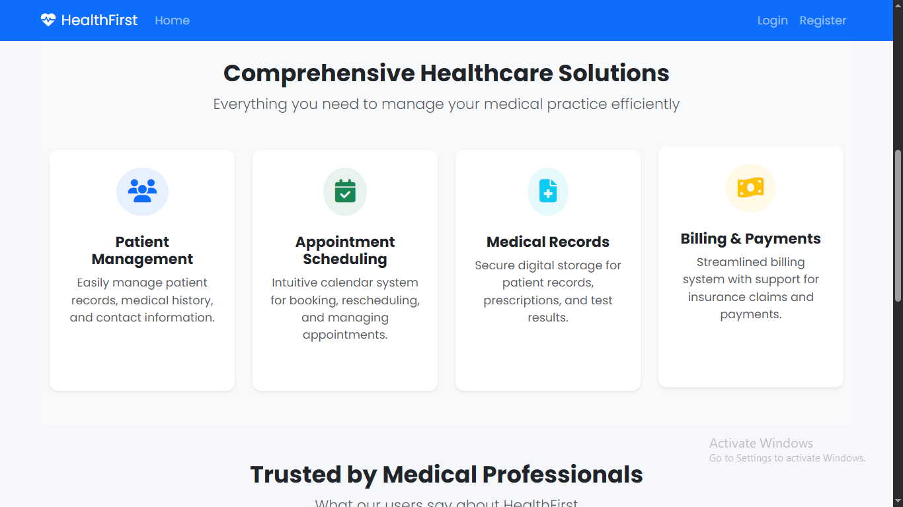
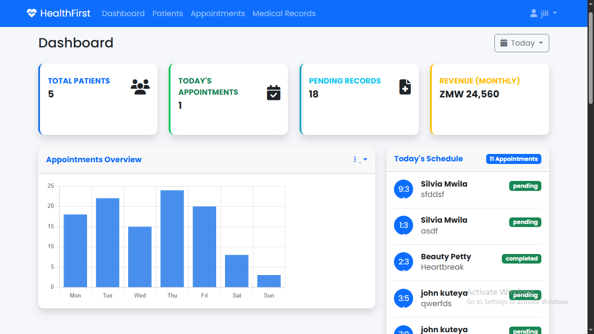
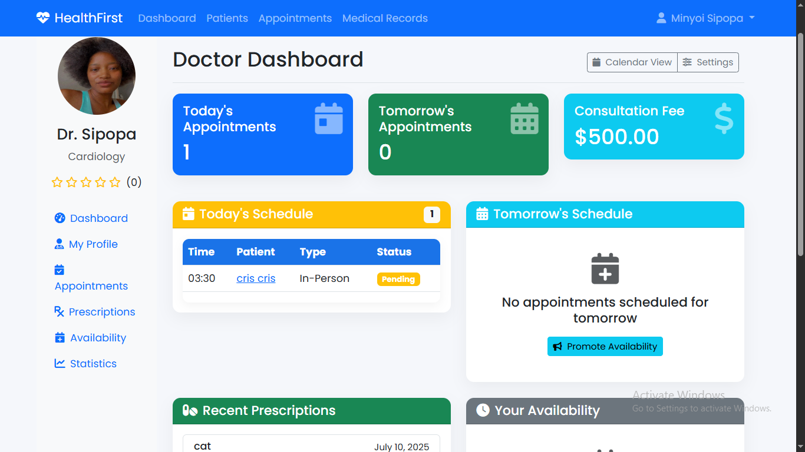
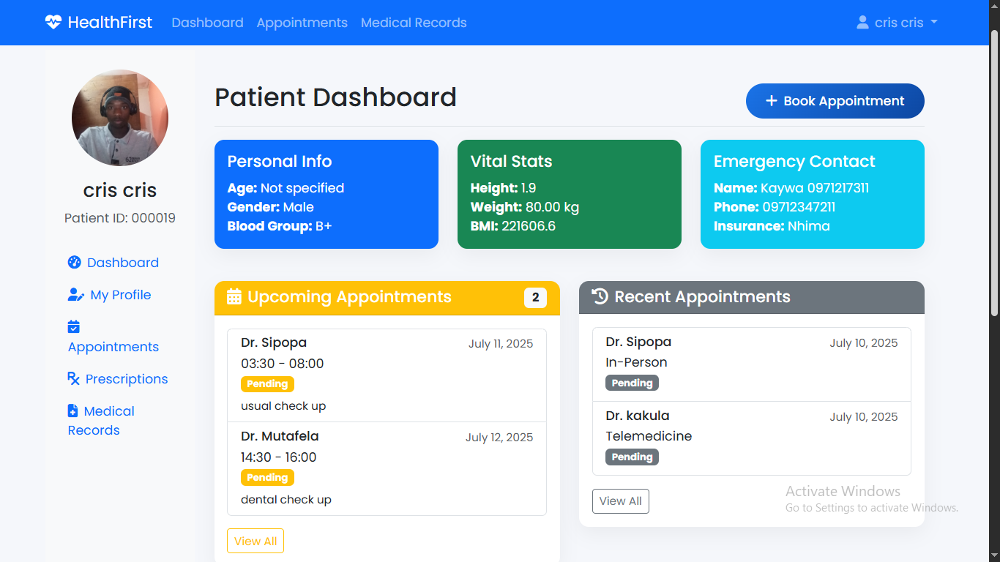
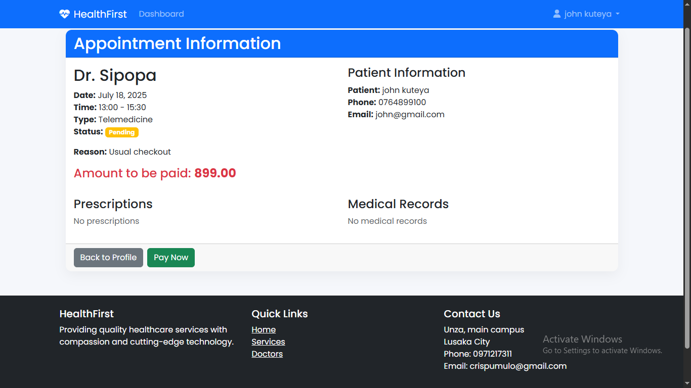
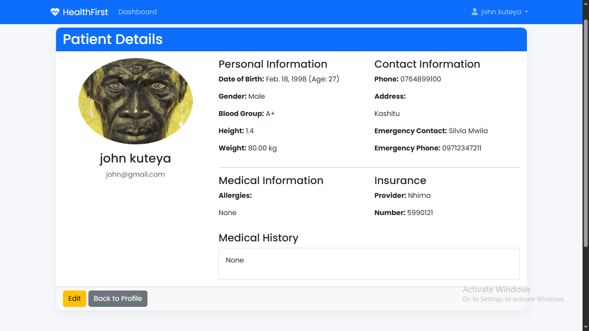
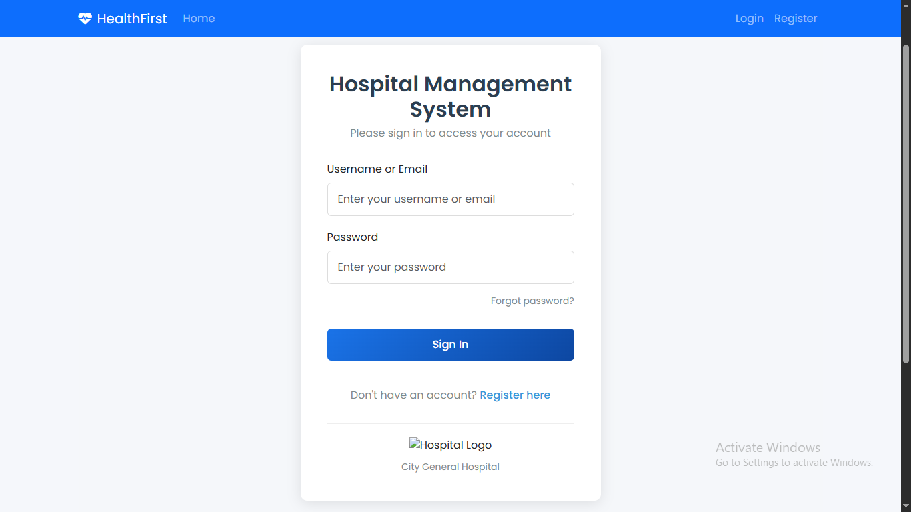

# Hospital Management System (HMS)

A robust, full-stack platform engineered for high-integrity data environments. Built with Django and PostgreSQL, it features secure Stripe payment processing, mirroring the reliability and security required in financial systems.

---

##   Features

1. **Role-Based Access Control (RBAC)**: Ensures strict hierarchical data access (Admin, Manager, User).
2. **Secure Transaction Processing**: Integrated, PCI-compliant payment gateway for fee and service billing.
3. **Audit-Ready Records Management**: Maintains immutable logs of all transactions and user activities.
4. **Comprehensive Dashboard Analytics**: Provides real-time insights into system operations and financial summaries.
5. **Advanced User Authentication & Session Management**: Implements industry-standard security protocols.

---

##  Tech Stack

1. **Backend Framework**: Django (Python)
2. **Database**: PostgreSQL (Emphasizing ACID compliance and data integrity)
3. **Payment Gateway**: Stripe API
4. **Frontend**: Bootstrap + Django Templates (Responsive UI)
5. **Security**: CSRF protection, ORM-based SQL injection prevention, secure authentication.
6. **Deployment**: Container-ready for secure, scalable deployment (Docker).

---

##   Screenshots

|  Admin Dashboard  |  Doctor Dashboard  |  Patient Dashboard  |
|-------------------|--------------------|---------------------|
|  |  |  |

|  Appointment Booking  |  Patient Info  |  Login Page  |
|-----------------------|----------------|--------------|
|  |  |  |

This project is licensed under the [MIT License](./LICENSE).